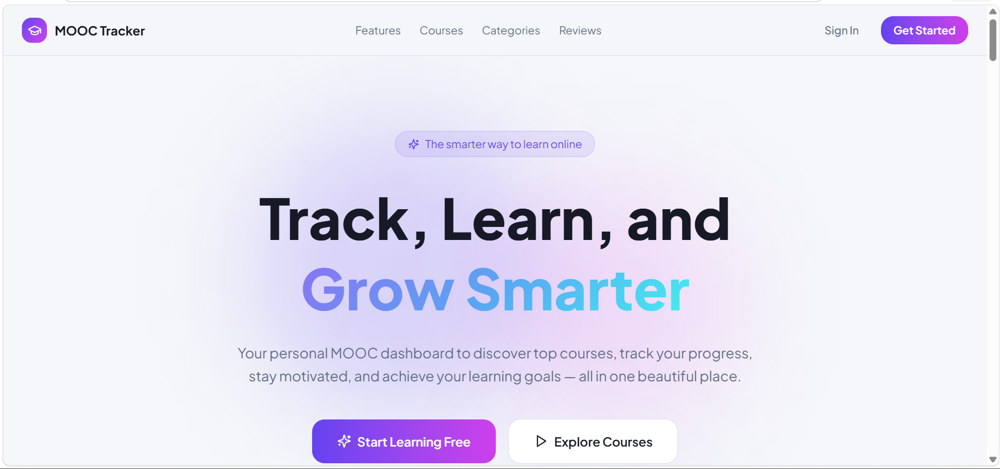
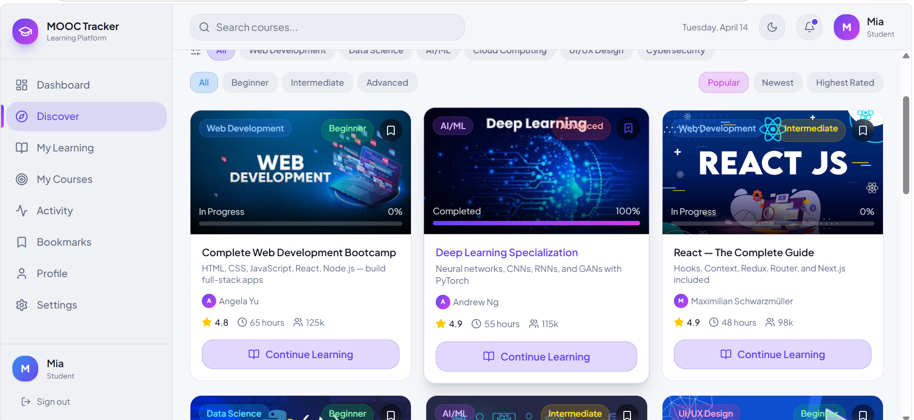
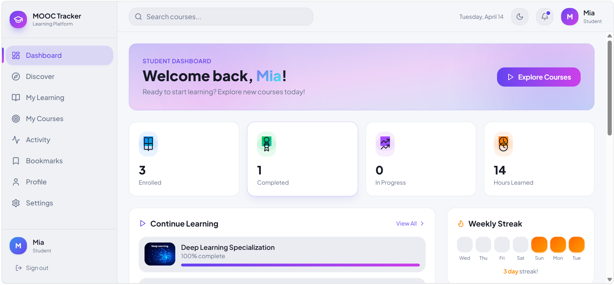

# 🎓 Student MOOC Tracker

A modern, responsive web application designed to help students **discover courses, track learning progress, and manage their online education journey** — all in one place.

This platform simulates a real-world MOOC (Massive Open Online Course) system with **role-based access for Students and Instructors**, interactive dashboards, and a clean UI experience.

---

## 🚀 Overview

Student MOOC Tracker is built as a frontend-focused application that replicates the core features of platforms like Coursera and Udemy.

It allows:
- Students to explore and track courses
- Instructors to manage learning content
- Users to monitor progress and stay motivated

The application uses **LocalStorage for authentication and data persistence**, making it lightweight and easy to run without a backend.

---

## ✨ Key Features

### 👨‍🎓 Student Features
- Browse and explore courses by category
- View course details (title, instructor, duration, rating)
- Enroll in courses
- Track learning progress
- View personal dashboard with learning stats
- Bookmark favorite courses
- Monitor activity and learning history

---

### 👨‍🏫 Instructor Features
- Access instructor dashboard
- Manage courses (view and organize)
- Monitor student engagement (UI simulation)
- Role-based interface for better separation of functionality

---

### 🔐 Authentication System
- Login and Signup functionality
- Role-based access (Student / Instructor)
- Session persistence using LocalStorage
- Protected navigation experience

---

### 📊 Dashboard & Analytics
- Course progress tracking
- Completion rate indicators
- Learning statistics visualization
- Clean and structured UI components

---

### 🎨 UI/UX Highlights
- Modern and responsive design
- Gradient-based hero section
- Interactive course cards with thumbnails
- Smooth layouts with reusable components
- Fully optimized for different screen sizes

---

## 🛠️ Tech Stack

| Technology | Usage |
|----------|------|
| React | UI Development |
| TypeScript | Type Safety |
| Vite | Fast Development & Build |
| Tailwind CSS | Styling |
| LocalStorage | Data Persistence |
| Radix UI | UI Components |
| Lucide Icons | Icons |


---

## ▶️ Getting Started

### 1. Clone the repository

```bash
git clone https://github.com/YOUR_USERNAME/Student_MOOC_Tracker.git
cd mooc-tracker
2. Install dependencies
npm install
3. Run the development server
npm run dev
4. Build for production
npm run build


## 📸 Screenshots

### 🏠 Landing Page


### 📚 Course Discovery


### 📊 Dashboard


### 🔐 Login Page


⭐ If you like this project

Give it a ⭐ on GitHub and feel free to fork and improve!
